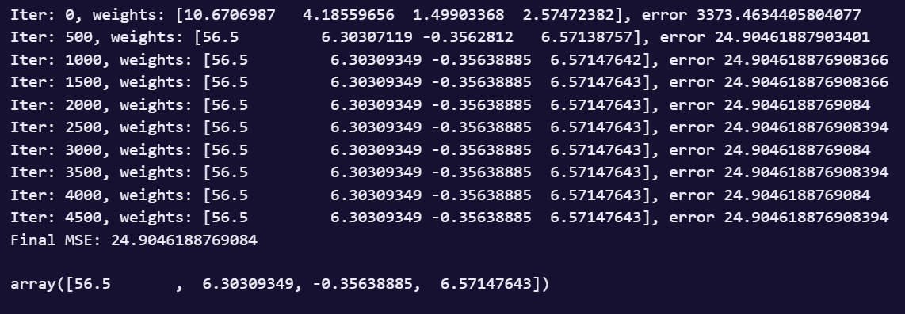

# РОССИЙСКИЙ УНИВЕРСИТЕТ ДРУЖБЫ НАРОДОВ

**Факультет физико-математических и естественных наук**

**Кафедра теории вероятностей и кибербезопасности**

---

## **ОТЧЕТ ПО ЛАБОРАТОРНОЙ РАБОТЕ № 2**

**Дисциплина:** Компьютерные науки и технологии программирования

**Студент:** Каримов Тимур Ринатович

**Группа:** НММбд-02-24

**Преподаватель:** Бегишев В.О.

**МОСКВА 2025 г.**

---

## **Цель работы:**

Умение технически реализовывать стохастический градиентный спуск, его отличие от наивного. Понимание оптимальных случаев для применения масштабирования. Изучение нового метода для оптимизации обучения - регуляризации. 

---

## **Выполнение работы**

### **Задание 1: 
**Формулировка:** Напишите функцию наподобие gradient_descent_reg_l2, но для применения L1-регуляризации.
Первым делом, вспоминаем как выглядит функция градиентного спуска с $L_2$ регуляризацией. Заметим, что основная разница в этих строчка кода:

```Pyhton
dReg = 2* reg * W
W -= eta * (dQ + dReg) 
```

Заменим производную $L_2$ регуляризации на $L_1$. 


**Листинг программы/команд:**
```Python
def gradient_descent_reg_l2(X, y, iterations, eta=1e-4, reg=1e-8):

    W = np.random.randn(X.shape[1])

    n = X.shape[0]

    for i in range(0, iterations):

        y_pred = np.dot(X, W)

        err = calc_mse(y, y_pred)

        dQ = 2/n * X.T @ (y_pred - y)

        dReg = 2* reg * W 

        W -= eta * (dQ + dReg)

        if i % (iterations / 10) == 0:

            print(f'Iter: {i}, weights: {W}, error {err}')

    print(f'Final MSE: {calc_mse(y, np.dot(X, W))}')

    return W

```

Результат: 

![[Pasted image 20250929124837.png]]  


Сравним с $L_2$ регуляризацией:

{#fig:001 width=70%}


Заметим, что на текущих данных разница минимально, однако $L_2$ все же сходится быстрее. 

### **Задание 2: 
**Формулировка:**  2. Можно ли к одному и тому же признаку применить сразу и нормализацию, и стандартизацию?

В таком роде нет практической пользы. Напротив, так как стандартизация сохраняет форму распределения, нормализация искажает распределение, по итогу совместное применение запутывает интерпретацию

Графики подтверждающие это

![[Pasted image 20250929220006.png]]

Заметим, что только сходимость ухудшилась по сравнению со стандартизацией, которую обычно используют для нейронной сети

![[Pasted image 20250929220044.png]]

Смотря на нормальное распределение, можно заметить, что центрирование около 0 теряется. Ниже представлен код

```Python
import numpy as np

from sklearn import datasets

import matplotlib.pyplot as plt

  

X, Y, coef = datasets.make_regression(n_samples=1000, n_features=2, n_informative=2,

                                      n_targets=1, noise=5, coef=True, random_state=2)

X[:, 0] *= 10

  

# Исходные данные

print("1. ИСХОДНЫЕ ДАННЫЕ:")

print(f"   Столбец 0: mean={np.mean(X[:, 0]):.2f}, std={np.std(X[:, 0]):.2f}, min={np.min(X[:, 0]):.2f}, max={np.max(X[:, 0]):.2f}")

print(f"   Столбец 1: mean={np.mean(X[:, 1]):.2f}, std={np.std(X[:, 1]):.2f}, min={np.min(X[:, 1]):.2f}, max={np.max(X[:, 1]):.2f}")

  

means = np.mean(X, axis=0)

stds = np.std(X, axis=0)

X_standardized = (X - means) / stds

  

print("\n2. ПОСЛЕ СТАНДАРТИЗАЦИИ (как в вашем коде):")

print(f"   Столбец 0: mean={np.mean(X_standardized[:, 0]):.2f}, std={np.std(X_standardized[:, 0]):.2f}, min={np.min(X_standardized[:, 0]):.2f}, max={np.max(X_standardized[:, 0]):.2f}")

print(f"   Столбец 1: mean={np.mean(X_standardized[:, 1]):.2f}, std={np.std(X_standardized[:, 1]):.2f}, min={np.min(X_standardized[:, 1]):.2f}, max={np.max(X_standardized[:, 1]):.2f}")

  

mins = np.min(X_standardized, axis=0)

maxs = np.max(X_standardized, axis=0)

X_double_transformed = (X_standardized - mins) / (maxs - mins)

  

print("\n3. ПОСЛЕ ДОПОЛНИТЕЛЬНОЙ НОРМАЛИЗАЦИИ (проблема!):")

print(f"   Столбец 0: mean={np.mean(X_double_transformed[:, 0]):.2f}, std={np.std(X_double_transformed[:, 0]):.2f}, min={np.min(X_double_transformed[:, 0]):.2f}, max={np.max(X_double_transformed[:, 0]):.2f}")

print(f"   Столбец 1: mean={np.mean(X_double_transformed[:, 1]):.2f}, std={np.std(X_double_transformed[:, 1]):.2f}, min={np.min(X_double_transformed[:, 1]):.2f}, max={np.max(X_double_transformed[:, 1]):.2f}")

  

X_only_normalized = (X - np.min(X, axis=0)) / (np.max(X, axis=0) - np.min(X, axis=0))

  

print("\n4. ТОЛЬКО НОРМАЛИЗАЦИЯ (для сравнения):")

print(f"   Столбец 0: mean={np.mean(X_only_normalized[:, 0]):.2f}, std={np.std(X_only_normalized[:, 0]):.2f}, min={np.min(X_only_normalized[:, 0]):.2f}, max={np.max(X_only_normalized[:, 0]):.2f}")

print(f"   Столбец 1: mean={np.mean(X_only_normalized[:, 1]):.2f}, std={np.std(X_only_normalized[:, 1]):.2f}, min={np.min(X_only_normalized[:, 1]):.2f}, max={np.max(X_only_normalized[:, 1]):.2f}")

  

plt.figure(figsize=(15, 10))

  

# Исходные данные

plt.subplot(2, 3, 1)

plt.scatter(X[:, 0], X[:, 1], alpha=0.5)

plt.title('Исходные данные')

plt.xlabel('Признак 0')

plt.ylabel('Признак 1')

plt.grid(True)

  

# После стандартизации

plt.subplot(2, 3, 2)

plt.scatter(X_standardized[:, 0], X_standardized[:, 1], alpha=0.5)

plt.title('После стандартизации\n(mean=0, std=1)')

plt.xlabel('Признак 0')

plt.ylabel('Признак 1')

plt.grid(True)

  

# После двойного преобразования

plt.subplot(2, 3, 3)

plt.scatter(X_double_transformed[:, 0], X_double_transformed[:, 1], alpha=0.5)

plt.title('После стандартизации + нормализации\n(ПРОБЛЕМА!)')

plt.xlabel('Признак 0')

plt.ylabel('Признак 1')

plt.grid(True)

  

# Только нормализация

plt.subplot(2, 3, 4)

plt.scatter(X_only_normalized[:, 0], X_only_normalized[:, 1], alpha=0.5)

plt.title('Только нормализация\n(range=[0,1])')

plt.xlabel('Признак 0')

plt.ylabel('Признак 1')

plt.grid(True)

  

# Гистограммы распределения признака 0

plt.subplot(2, 3, 5)

plt.hist(X_standardized[:, 0], alpha=0.7, label='Только стандартизация', bins=20)

plt.hist(X_double_transformed[:, 0], alpha=0.7, label='Стандартизация + нормализация', bins=20)

plt.title('Сравнение распределений\n(признак 0)')

plt.legend()

plt.grid(True)

  

# Гистограммы распределения признака 1

plt.subplot(2, 3, 6)

plt.hist(X_standardized[:, 1], alpha=0.7, label='Только стандартизация', bins=20)

plt.hist(X_double_transformed[:, 1], alpha=0.7, label='Стандартизация + нормализация', bins=20)

plt.title('Сравнение распределений\n(признак 1)')

plt.legend()

plt.grid(True)

  

plt.tight_layout()

plt.show()

  

def test_model_performance(X_data, method_name):

    X_with_bias = np.hstack([np.ones((X_data.shape[0], 1)), X_data])

    W = np.random.randn(X_with_bias.shape[1])

    errors = []

    for i in range(1000):

        y_pred = np.dot(X_with_bias, W)

        dQ = 2 / len(Y) * X_with_bias.T @ (y_pred - Y)

        W -= 0.01 * dQ

        if i % 100 == 0:

            error = np.mean((y_pred - Y)**2)

            errors.append(error)

    final_error = np.mean((np.dot(X_with_bias, W) - Y)**2)

    print(f"{method_name}: финальная MSE = {final_error:.6f}")

    return final_error, errors

  

print("\n=== ВЛИЯНИЕ НА ОБУЧЕНИЕ МОДЕЛИ ===")

error_std, errors_std = test_model_performance(X_standardized, "Только стандартизация")

error_double, errors_double = test_model_performance(X_double_transformed, "Стандартизация + нормализация")

error_norm, errors_norm = test_model_performance(X_only_normalized, "Только нормализация")

  

# График сходимости

plt.figure(figsize=(10, 6))

plt.plot(errors_std, label='Только стандартизация', linewidth=2)

plt.plot(errors_double, label='Стандартизация + нормализация', linewidth=2)

plt.plot(errors_norm, label='Только нормализация', linewidth=2)

plt.xlabel('Итерации (×100)')

plt.ylabel('MSE')

plt.title('Влияние двойного преобразования на сходимость')

plt.legend()

plt.grid(True)

plt.show()

  

print(f"\n=== ВЫВОДЫ ===")

print("1. Двойное преобразование ИСКАЖАЕТ распределение данных")

print("2. Потеряны преимущества обоих методов:")

print("   - После стандартизации mean=0, std=1")

print("   - После нормализации эти свойства теряются!")

print("3. Модель обучается ХУЖЕ (MSE выше)")

print("4. Выберите ОДИН метод преобразования!")
```


### **Задание 3: 
**Формулировка: **  3. Сгенерируйте датасет при помощи <code>sklearn.datasets.make_regression</code> и обучите линейную модель при помощи градиентного и стохастического градиентного спуска. Нанесите среднеквадратичную ошибку для обоих методов на один график, сделайте выводы о разнице скорости сходимости каждого из методов.

Вкратце, задача сводится к тому, что мы пишем 3 функции, для них строим датасет со случайными данными и выводим график (по условию). Техническая реализация не представляет проблем так как теоретической части это всё было продемонстрировано. 

Решение

```Python
import numpy as np

from sklearn import datasets

import matplotlib.pyplot as plt

  

X, Y, coef = datasets.make_regression(n_samples=1000, n_features=2, n_informative=2,

                                      n_targets=1, noise=5, coef=True, random_state=2)

  

X[:, 0] *= 10

  


means = np.mean(X, axis=0)

stds = np.std(X, axis=0)

X = (X - means) / stds  

  
  

X_with_bias = np.hstack([np.ones((X.shape[0], 1)), X])

  

def calc_mse(y, y_pred):

    return np.mean((y - y_pred)**2)

  

def gradient_descent(X, y, iterations, eta):

    W = np.random.randn(X.shape[1])

    errors = []

    for i in range(iterations):

        y_pred = np.dot(X, W)

        dQ = 2 / len(y) * X.T @ (y_pred - y)

        W -= eta * dQ

        if i % 10 == 0:

            error = calc_mse(y, np.dot(X, W))

            errors.append(error)

    return W, errors

  

def stohastic_gradient_descent(X, y, iterations, size, eta):

    W = np.random.randn(X.shape[1])

    errors = []

    n = X.shape[0]

    for i in range(iterations):

        inds = np.random.choice(n, size=size, replace=False)

        X_tmp = X[inds]

        y_tmp = y[inds]

        y_pred_tmp = np.dot(X_tmp, W)

        dQ = 2 / size * X_tmp.T @ (y_pred_tmp - y_tmp)

        W -= eta * dQ

        if i % 10 == 0:

            error = calc_mse(y, np.dot(X, W))

            errors.append(error)

    return W, errors

  

iterations = 1000

eta = 0.01

batch_size = 32

  

W_gd, errors_gd = gradient_descent(X_with_bias, Y, iterations, eta)

W_sgd, errors_sgd = stohastic_gradient_descent(X_with_bias, Y, iterations, batch_size, eta)

  

# Визуализация

plt.figure(figsize=(12, 6))

  

# График ошибок

plt.subplot(1, 2, 1)

plt.plot(errors_gd, label='GD', color='blue', alpha=0.7)

plt.plot(errors_sgd, label='SGD', color='red', alpha=0.7)

plt.xlabel('Итерации (×10)')

plt.ylabel('MSE')

plt.title('Сравнение скорости сходимости GD и SGD')

plt.legend()

plt.grid(True)

  

# График в логарифмической шкале для лучшей визуализации

plt.subplot(1, 2, 2)

plt.semilogy(errors_gd, label='GD', color='blue', alpha=0.7)

plt.semilogy(errors_sgd, label='SGD', color='red', alpha=0.7)

plt.xlabel('Итерации (×10)')

plt.ylabel('MSE (log scale)')

plt.title('MSE в логарифмической шкале')

plt.legend()

plt.grid(True)

  

plt.tight_layout()

plt.show()

  

# Вывод результатов

print(f"Исходные коэффициенты: {coef}")

print(f"GD финальные веса: {W_gd[1:]}")  # Исключаем bias

print(f"SGD финальные веса: {W_sgd[1:]}")

print(f"GD финальная MSE: {errors_gd[-1]:.6f}")

print(f"SGD финальная MSE: {errors_sgd[-1]:.6f}")
```

Результат: 

![[Pasted image 20250929214535.png]]

