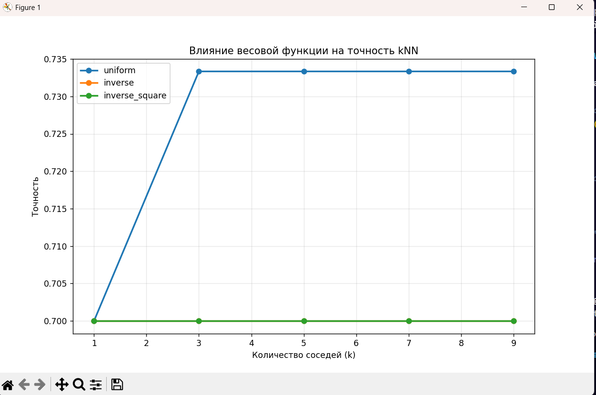
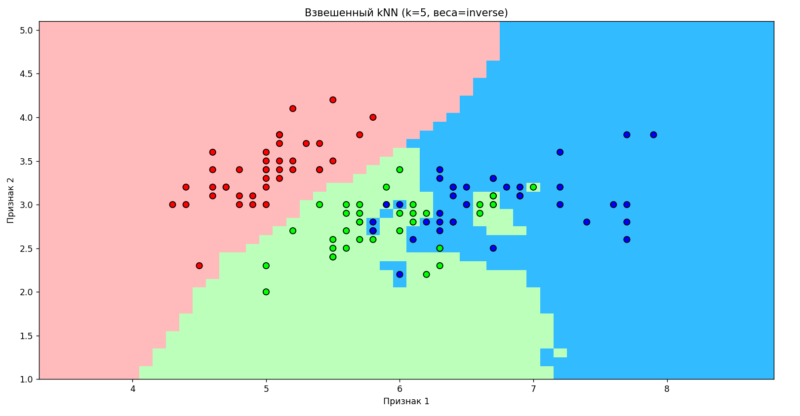

# РОССИЙСКИЙ УНИВЕРСИТЕТ ДРУЖБЫ НАРОДОВ

**Факультет физико-математических и естественных наук**

**Кафедра теории вероятностей и кибербезопасности**

---

## **ОТЧЕТ ПО ЛАБОРАТОРНОЙ РАБОТЕ № **

**Дисциплина:** Компьютерные науки и технологии программирования

**Студент:** Каримов Тимур Ринатович

**Группа:** 1132246817

**Преподаватель:** Бегишев В.О.

**МОСКВА 2024 г.**

---

## **Цель работы:**


---

## **Выполнение работы**

### **Задание 1: 

 К алгоритму kNN, реализованному в этой работе, реализовать добавление весов для соседей по любому из показанных в этой лабораторной принципов.
  
### Решение

В обычном kNN каждый из k ближайших соседей имеет одинаковый голос (вес = 1). Во взвешенном kNN ближайшие соседи имеют **больший вес**, чем более далекие.

Я добавил добавил в функцию `knn_weighted'

```Python
def knn_weighted(x_train, y_train, x_test, k, weight_type='uniform'):

```

 Для каждого тестового объекта: находим k ближайших соседей
```Python
neighbors = sorted(test_distances)[0:k]
```
Применяем весовую функцию:

```python

if weight_type == 'uniform':
    weight = 1.0
elif weight_type == 'inverse':
    # Близкие объекты = большой вес
    weight = 1.0 / (distance + 1e-10)
elif weight_type == 'inverse_square':
    # Еще сильнее усиливаем близкие объекты
    weight = 1.0 / (distance**2 + 1e-10)
elif weight_type == 'gaussian':
    # Экспоненциальное убывание веса
    weight = np.exp(-distance**2 / (2 * sigma**2))
```

#### Суммируем веса по классам:

```Python

classes[class_label] += weight
```
 Выбираем класс с наибольшим суммарным весом:
```Python
answers.append(max(classes, key=classes.get))
```

Код:
```Python
import numpy as np
from sklearn.model_selection import train_test_split
from sklearn.datasets import load_iris
import matplotlib.pyplot as plt
from matplotlib.colors import ListedColormap

# Загрузка данных
X, y = load_iris(return_X_y=True)
X = X[:, :2]  # Для наглядности возьмем только первые два признака
X_train, X_test, y_train, y_test = train_test_split(X, y, test_size=0.2, random_state=1, stratify=y)

# Евклидова метрика расстояния
def e_metrics(x1, x2):
    distance = np.sum(np.square(x1 - x2))
    return np.sqrt(distance)

# Модифицированный алгоритм kNN с весами
def knn_weighted(x_train, y_train, x_test, k, weight_type='uniform'):
    """
    Реализация kNN с весами
    
    Параметры:
    -----------
    weight_type : str
        Тип весовой функции:
        - 'uniform': равные веса (стандартный kNN)
        - 'inverse': обратное расстояние (1 / distance)
        - 'inverse_square': обратный квадрат расстояния (1 / distance^2)
        - 'gaussian': гауссовское ядро exp(-distance^2 / sigma^2)
    """
    answers = []
    
    for x in x_test:
        test_distances = []
        
        # Рассчитываем расстояния до всех объектов обучающей выборки
        for i in range(len(x_train)):
            distance = e_metrics(x, x_train[i])
            test_distances.append((distance, y_train[i]))
        
        # Сортируем по расстоянию и берем k ближайших соседей
        neighbors = sorted(test_distances)[0:k]
        
        # Создаем словарь для подсчета взвешенных голосов
        classes = {class_item: 0.0 for class_item in set(y_train)}
        
        # Применяем весовую функцию
        for distance, class_label in neighbors:
            if weight_type == 'uniform':
                weight = 1.0
            elif weight_type == 'inverse':
                # Добавляем маленькое значение для избежания деления на 0
                weight = 1.0 / (distance + 1e-10)
            elif weight_type == 'inverse_square':
                weight = 1.0 / (distance**2 + 1e-10)
            elif weight_type == 'gaussian':
                # Автоматический подбор sigma (можно настроить)
                sigma = np.mean([d for d, _ in neighbors]) + 1e-10
                weight = np.exp(-distance**2 / (2 * sigma**2))
            else:
                raise ValueError(f"Неизвестный тип весов: {weight_type}")
            
            classes[class_label] += weight
        
        # Выбираем класс с наибольшим суммарным весом
        answers.append(max(classes, key=classes.get))
    
    return answers

# Функция для оценки точности
def accuracy(pred, y):
    return sum(pred == y) / len(y)

# Тестирование с разными типами весов
k = 5
weight_types = ['uniform', 'inverse', 'inverse_square', 'gaussian']

print("Сравнение разных весовых функций при k =", k)
print("-" * 50)

for weight_type in weight_types:
    y_pred = knn_weighted(X_train, y_train, X_test, k, weight_type)
    acc = accuracy(y_pred, y_test)
    print(f"Тип весов: {weight_type:15} Точность: {acc:.4f}")

# Визуализация с весами
def get_graph_weighted(X_train, y_train, k, weight_type='inverse'):
    cmap_light = ListedColormap(['#FFAAAA', '#AAFFAA', '#00AAFF'])
    cmap = ListedColormap(['#FF0000', '#00FF00', '#0000FF'])
    
    h = .1
    x_min, x_max = X_train[:, 0].min() - 1, X_train[:, 0].max() + 1
    y_min, y_max = X_train[:, 1].min() - 1, X_train[:, 1].max() + 1
    xx, yy = np.meshgrid(np.arange(x_min, x_max, h), np.arange(y_min, y_max, h))
    
    # Используем взвешенный kNN для предсказаний
    Z = knn_weighted(X_train, y_train, np.c_[xx.ravel(), yy.ravel()], k, weight_type)
    
    # Построение графика
    Z = np.array(Z).reshape(xx.shape)
    plt.figure(figsize=(10, 8))
    plt.pcolormesh(xx, yy, Z, cmap=cmap_light, alpha=0.8)
    
    # Добавление обучающей выборки
    plt.scatter(X_train[:, 0], X_train[:, 1], c=y_train, cmap=cmap, edgecolor='black', s=50)
    plt.xlim(xx.min(), xx.max())
    plt.ylim(yy.min(), yy.max())
    plt.title(f"Взвешенный kNN (k={k}, веса={weight_type})")
    plt.xlabel("Признак 1")
    plt.ylabel("Признак 2")
    plt.show()

# Пример визуализации с обратными весами
get_graph_weighted(X_train, y_train, k=5, weight_type='inverse')

# Сравнение влияния весов на разных значениях k
print("\nСравнение точности для разных k и типов весов:")
print("-" * 60)

k_values = [1, 3, 5, 7, 9]
weight_types = ['uniform', 'inverse', 'inverse_square']

# Таблица результатов
results = np.zeros((len(k_values), len(weight_types)))

for i, k in enumerate(k_values):
    for j, weight_type in enumerate(weight_types):
        y_pred = knn_weighted(X_train, y_train, X_test, k, weight_type)
        results[i, j] = accuracy(y_pred, y_test)

# Вывод результатов
print("\nk\tUniform\t\tInverse\t\tInverse_square")
print("-" * 50)
for i, k in enumerate(k_values):
    print(f"{k}\t{results[i, 0]:.4f}\t\t{results[i, 1]:.4f}\t\t{results[i, 2]:.4f}")

# Визуализация результатов
plt.figure(figsize=(10, 6))
for j, weight_type in enumerate(weight_types):
    plt.plot(k_values, results[:, j], marker='o', label=weight_type, linewidth=2)

plt.xlabel('Количество соседей (k)')
plt.ylabel('Точность')
plt.title('Влияние весовой функции на точность kNN')
plt.legend()
plt.grid(True, alpha=0.3)
plt.show()
```


{#fig:01 width=70%}

{#fig:01 width=70%}


### **Задание 2: 

Написать функцию подсчета метрики качества кластеризации как среднее квадратичное внутрикластерное расстояние и построить график ее зависимости от количества кластеров k (взять от 1 до 10) для выборки данных из данной лабораторной.
  
### Решение


В алгоритме k-means **качество кластеризации** измеряется тем, насколько компактно точки сгруппированы вокруг своих центроидов. Среднее квадратичное внутрикластерное расстояние — это метрика, которая показывает, насколько хорошо точки внутри каждого кластера сгруппированы вокруг своего центра.

## **Я добавил функцию `calculate_within_cluster_sse`:**

```Python
def calculate_within_cluster_sse(data, clusters, centroids):
    """
    Вычисляет среднее квадратичное внутрикластерное расстояние (within-cluster SSE)
    """
    total_sse = 0.0
    total_points = 0
    
    for cluster_id in clusters:
        if clusters[cluster_id]:
            points = np.array(clusters[cluster_id])
            centroid = centroids[cluster_id]
            
            # Вычисляем сумму квадратов расстояний от точек до центроида кластера
            distances_squared = np.sum((points - centroid) ** 2)
            total_sse += distances_squared
            total_points += len(points)
    
    # Среднее квадратичное расстояние (нормируем на количество точек)
    if total_points > 0:
        return total_sse / total_points
    else:
        return 0.0
```


**Для каждого кластера вычисляем сумму квадратов расстояний:**
```Python
distances_squared = np.sum((points - centroid) ** 2)
```
Это сумма квадратов расстояний от каждой точки кластера до его центроида.

**Суммируем по всем кластерам:**
```Python
total_sse += distances_squared
total_points += len(points)
```
Складываем суммы квадратов расстояний для всех кластеров и считаем общее количество точек.

**Вычисляем среднее значение:**
```Python
return total_sse / total_points
```
Делим общую сумму квадратов расстояний на количество точек, чтобы получить среднее значение.

 **Что показывает эта метрика:**

1. **Малое значение**: точки расположены близко к центроидам (хорошая кластеризация)
2. **Большое значение**: точки разбросаны далеко от центроидов (плохая кластеризация)
3. **При увеличении k**: метрика уменьшается (больше кластеров → более компактные группы)

### **Задание 3: 

Оптимизировать код для KNN (оставить один цикл, либо обойтись без циклов вообще).
  
### Решение

**Было (старая версия с циклами):**

```Python
def knn(x_train, y_train, x_test, k):
    answers = []
    for x in x_test:  # ЦИКЛ 1: по всем тестовым точкам
        test_distances = []
        for i in range(len(x_train)):  # ЦИКЛ 2: по всем обучающим точкам
            distance = e_metrics(x, x_train[i])  # Считаем расстояние
            test_distances.append((distance, y_train[i]))
        # ... обработка k ближайших соседей
```
**Стало (оптимизированная версия):**
```python
def knn_vectorized(x_train, y_train, x_test, k):
    # 1. ВЫЧИСЛЯЕМ ВСЕ РАССТОЯНИЯ ОДНОЙ ОПЕРАЦИЕЙ
    x_train_norm = np.sum(x_train**2, axis=1)  # ||x_train||²
    x_test_norm = np.sum(x_test**2, axis=1)    # ||x_test||²
    
    # Магическая формула вместо циклов:
    distances = np.sqrt(
        x_test_norm[:, np.newaxis] +  # Делаем размер (n_test, 1)
        x_train_norm[np.newaxis, :] - # Делаем размер (1, n_train)
        2 * np.dot(x_test, x_train.T) # Умножаем матрицы
    )
    # Получаем матрицу размера (n_test, n_train) за одну операцию!
```

**Было: сортировка всех расстояний
```python
neighbors = sorted(test_distances)[0:k] 
```

Стало: находим только k наименьших
```
k_nearest_indices = np.argpartition(distances, k, axis=1)[:, :k]
```

argpartition быстрее, так как не сортирует все элементы